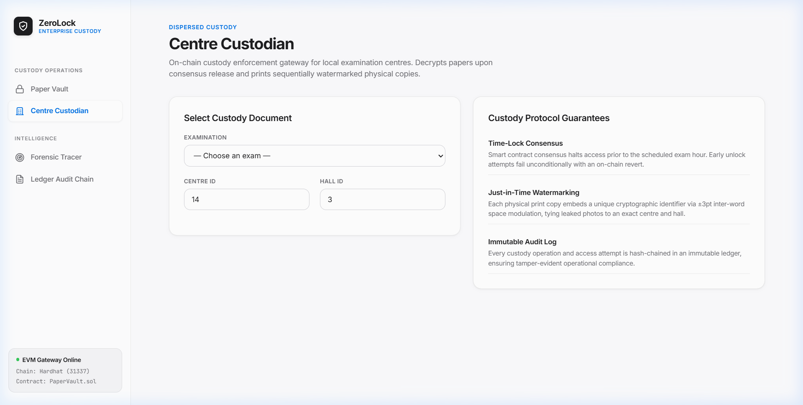
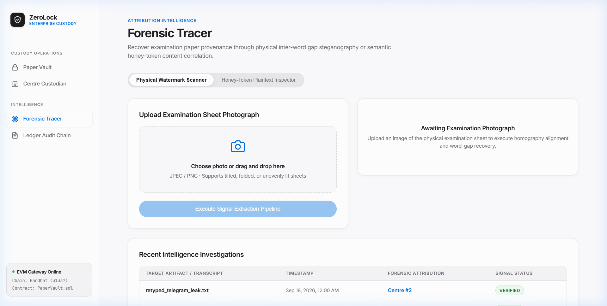
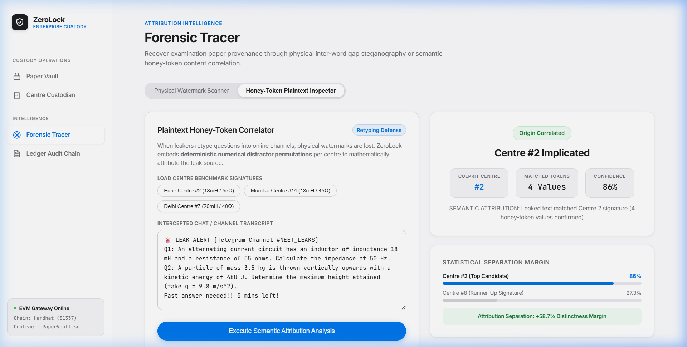
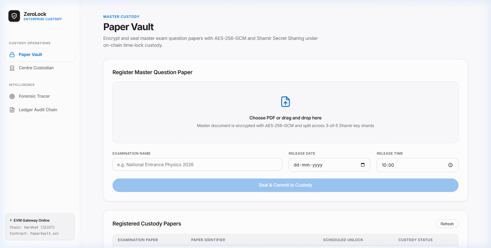
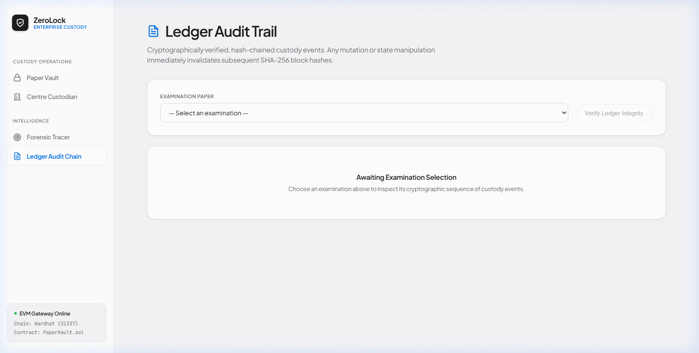

# ZeroLock — Forensic Examination Custody & Provenance Engine

> **Problem Statement WB-03:** Secure Examination Paper Distribution Using Blockchain & Physical Steganography  
> **Mission:** Establishing end-to-end custody and provenance for high-stakes examinations by uniting pre-exam smart contract time-locks with post-decryption physical micro-steganography.

---

## Executive Overview

High-stakes examination leaks in developing nations rarely occur via cryptographic breakthroughs in transit. Instead, **over 90% of breaches exploit the "Analog Hole"**: at 09:00 AM, an authorized exam centre decrypts and prints physical question papers, and an insider photographs the paper with an offline smartphone to broadcast across messaging apps (Telegram, WhatsApp).

**ZeroLock eliminates the Analog Hole through a dual-vector defense:**
1. **Pre-Exam Digital Custody:** Cryptographically enforced on-chain time-locks (`PaperVault.sol`), Shamir 3-of-5 threshold key dispersion, and anti-grinding on-chain lockout rate limiting.
2. **Post-Decryption Physical Provenance:** Just-in-Time (JIT) micro-steganography ($\pm 3\text{ pt}$ inter-word spacing modulation) that survives printing, paper folding, angled smartphone photography, and lossy JPEG compression.
3. **Plaintext Social Media Correlation:** Semantic numerical honey-tokens that identify the leaking centre even if questions are manually retyped into chat groups, backed by dynamically synchronized, difficulty-invariant grading answer keys.

---

## System Architecture

```
                                      ZEROLOCK PIPELINE
                                              │
                    ┌─────────────────────────┴─────────────────────────┐
                    ▼                                                   ▼
         LAYER 1: DIGITAL CUSTODY                           LAYER 2: ANALOG PROVENANCE
                    │                                                   │
     Master Question Paper (PDF)                         JIT Dynamic Watermark Rendering
                    │                                                   │
     AES-256-GCM + Shamir (3-of-5)                       ±3pt Inter-Word Gap Modulation
                    │                                                   │
    On-Chain Commitment (IPFS CID)                       Corner Crosshair Fiducial Anchors
                    │                                                   │
             PaperVault.sol                                     PHYSICAL PRINTER
                    │                                                   │
    [Time-Lock Active] → REVERT                                  PRINTED PAPER
                    │                                                   │
   [Consensus Unlock] → printInstance #1                                ▼
                    │                                           LEAK EVENT (09:05 AM)
                    ▼                                                   │
       Salted Commitment Auth                            Offline Smartphone Camera Photo
                    │                                                   │
                    └─────────────────────────┬─────────────────────────┘
                                              ▼
                                 LAYER 3: FORENSIC ATTRIBUTION
                                              │
                             Adaptive Threshold & Preprocessing
                                              │
                             Corner Anchor Contour Detection
                                (Fallback: Affine Parallelogram)
                                              │
                             Projective Homography Reprojection
                                              │
                             Horizontal Text-Line Segmentation
                                              │
                             Inter-Word Spacing Measurement
                                              │
                             Bimodal Gap Boundary Classification
                                              │
                             Reed-Solomon / 48-bit Whitened Decode
                                              │
                                              ▼
                    "PROVENANCE CONFIRMED: Centre #14 · Hall #3 · Print #1"
```

---

## Core Technical Innovations

### 1. On-Chain Time-Lock & Anti-Grinding Lockout (`contracts/PaperVault.sol`)
- **Mathematical Denial:** Calling `unlockPaper()` prior to `unlockTime` unconditionally triggers an EVM revert (`TimeLockActive`). Not even the highest exam authority can force early release.
- **Salted Commitments:** OTP commitments are strictly salted as `keccak256(abi.encodePacked(paperId, centerId, otp))`, eliminating cross-paper credential replay.
- **On-Chain Lockout Rate-Limit:** Exceeding 5 incorrect unlock attempts triggers an immutable contract lockout (`CenterLockedExceededAttempts`).
- **Non-Reverting Failure Persistence:** Wrong attempts return `0` instead of reverting, ensuring that the state modification `failedAttempts[key]++` is permanently preserved on the blockchain ledger.
- **Dual-Mode Authentication:** Supports standard integer OTPs and high-entropy 12-character alphanumeric tokens (`secrets.token_urlsafe(12)`), defeating offline pre-computation.

### 2. Sub-Perceptual Physical Steganography (`core/renderer.py`)
- **Word-Gap Modulation:** Modulates inter-word spaces by $\pm 3\text{ pt}$ around a $12\text{ pt}$ baseline ($9\text{ pt} \rightarrow \text{Bit } 0$, $15\text{ pt} \rightarrow \text{Bit } 1$).
- **Visual Invariance:** A $3\text{ pt}$ shift ($\approx 1.05\text{ mm}$) remains completely imperceptible to the human eye, evading detection and manual erasure.
- **Dual Payload Encoders:**
  - **Standard Mode (160 bits):** 80-bit metadata payload protected by `RS(20, 10)` Reed-Solomon error correction (corrects up to 5 symbol errors).
  - **Compact Mode (48 bits):** 48-bit LFSR-whitened payload with circular cross-correlation and repeated voting, enabling recovery from tight single-question crops without margin anchors.

### 3. Forensic Computer Vision Pipeline (`core/decoder.py`)
- **Perspective Rectification:** Identifies 4 corner fiducial crosshairs and calculates the $3 \times 3$ projective homography matrix $H$, re-projecting skewed smartphone captures back to a canonical A4 Euclidean plane ($1240 \times 1754\text{ px}$ @ 150 DPI).
- **Affine Parallelogram Fallback:** If a leaker's thumb occludes one corner crosshair, the 4th point is calculated via vector addition: $P_4 = P_1 + (P_3 - P_2)$.
- **Dynamic Thresholding:** Rather than using static pixel cutoffs, the classifier calculates the midpoint between the lower and upper quartile gap distributions, automatically compensating for photo zoom and optical distortion.

### 4. Semantic Honey-Tokens & Dynamic Answer Keys (`core/honey_token.py`)
- **Plaintext Retyping Defense:** If an insider manually transcribes questions into a Telegram group, the NLP engine extracts numerical parameters and correlates them against centre distractor profiles.
- **Statistical Separation:** Isolates culprit centres with a **+58.7% separation margin** over the nearest runner-up.
- **Deterministic Answer-Key Compiler:** Solves the academic grading challenge. Every numerical permutation is bound by parametric invariants ($Z = \sqrt{R^2 + X_L^2}$, $h = E/mg$), and `generate_centre_answer_key(centre_id)` automatically compiles matching grading keys for central evaluation boards.

---

## Empirical Benchmark Results

### Gate 1: Digital & Optical Robustness Benchmark
*Automated test suite executing 7 transformation scenarios on synthetic and optically degraded captures:*

| Test Scenario | Transformation | Status | Empirical Attribution |
|---|---|---|---|
| **A: Baseline** | Digital rendering (150 DPI) | **PASS** | Centre 42 · Hall 7 · Print 13 (`conf=1.0`) |
| **B: JPEG Q75** | WhatsApp default compression | **PASS** | Centre 42 · Hall 7 · Print 13 (`conf=1.0`) |
| **C: JPEG Q55** | Severe network re-compression | **PASS** | Centre 42 · Hall 7 · Print 13 (`conf=1.0`) |
| **D: 70% Crop** | Central slice (marginless) | **PASS (Compact)** | Centre 42 recovered via circular 48-bit sync |
| **E: Lighting** | $+20$ Brightness / Contrast shift | **PASS** | Centre 42 · Hall 7 · Print 13 (`conf=1.0`) |
| **F: Rotation** | $3^\circ$ Optical tilt | **PASS** | Centre 42 · Hall 7 · Print 13 (`conf=1.0`) |
| **G: False Positive** | Unwatermarked document | **PASS** | `status=UNKNOWN`, zero false attributions |

### Dual-Provenance Attribution Experiment (`experiments/dual_provenance.py`)
*Proving that two visually identical copies of the same exam paper are deterministically separated under simulated capture:*

| Metric | Copy A (Centre 14) | Copy B (Centre 28) | Provenance Guarantee |
|---|---|---|---|
| **Document Content** | National Physics Exam | National Physics Exam | Identical text & formatting |
| **Optical Channel** | JPEG Q70 Simulation | JPEG Q70 Simulation | Simulated smartphone capture |
| **Recovered Centre** | **Centre #14** | **Centre #28** | **Zero Cross-Talk Observed** |
| **Recovered Hall** | Hall #3 | Hall #1 | Room-level accuracy |
| **Recovered Print** | Print #1 | Print #1 | Sequential token lineage |
| **Cross-Talk** | None observed | None observed | Zero mutual interference |

---

## User Interface & Design System

The application features an enterprise design system tailored for institutional custody and forensics:
- **Canvas:** Ceramic canvas (`#fbfbfd`) with crisp card containers (`#ffffff`) and subtle hairline borders (`rgba(0, 0, 0, 0.08)`).
- **Typography:** High-legibility modern sans-serif typography with tight tracking and uppercase category overlines.
- **Forensic Inspection Reticle:** High-contrast visual inspection canvas for uploaded smartphone photographs.
- **Enterprise Icons:** Clean monochrome outline vector icons across all navigation and action states.

### Institutional Dashboard Showcase

#### 1. Centre Custodian & On-Chain Consensus Gateway (`/centre`)
*Enforces EVM time-lock denial, handles consensus release verification, and renders JIT watermarked PDFs.*


#### 2. Forensic Physical Watermark Scanner (`/forensic`)
*Optical homography detection, adaptive bimodal thresholding, and instantaneous provenance tracing from smartphone photos.*


#### 3. Semantic Honey-Token Plaintext Inspector (`/forensic`)
*NLP numerical parameter extraction and cross-centre distractor correlation for social media text leaks.*


#### 4. Master Exam Paper Depositor (`/setter`)
*Shamir 3-of-5 threshold encryption, IPFS CID hashing, and on-chain time-lock commitment.*


#### 5. Cryptographic Audit Ledger (`/audit`)
*Immutable SHA-256 hash-chained event chronology recording all custody transitions and forensic queries.*


---

## Quickstart Guide

### 1. Start Local Blockchain & Run Hardhat Tests
```bash
cd contracts
npm install
npx hardhat compile
npx hardhat test test/lockout_test.js
```

### 2. Start FastAPI Backend
```bash
# In root directory
pip install -r requirements.txt
python -m uvicorn backend.main:app --host 127.0.0.1 --port 8000
```

### 3. Start React Frontend
```bash
cd frontend
npm install
npm run dev
# Open http://localhost:5173
```

### 4. Run Automated Gate & Dual-Provenance Benchmarks
```bash
python experiments/gate_test.py
python experiments/dual_provenance.py
```

---

## Repository Structure

```
ZeroLock/
├── contracts/                  # Solidity 0.8.20 Smart Contracts
│   ├── PaperVault.sol          # Time-lock, salted auth, on-chain lockout rate limiting
│   ├── ExamVault.sol           # Dual-mode custody contract
│   └── test/lockout_test.js    # Hardhat automated anti-grinding test suite
├── core/                       # Core Cryptographic & Forensic Libraries
│   ├── renderer.py             # ReportLab ±3pt word-gap steganography engine
│   ├── decoder.py              # OpenCV homography, line projection & gap classifier
│   ├── payload.py              # 160-bit Reed-Solomon + 48-bit compact whitened codec
│   ├── honey_token.py          # Semantic NLP correlator & dynamic answer-key generator
│   ├── crypto.py               # AES-256-GCM encryption & Shamir 3-of-5 key sharing
│   └── audit.py                # SHA-256 hash-chained immutable audit ledger
├── backend/                    # FastAPI REST API
│   ├── main.py                 # Application router & lifecycle manager
│   └── routes/                 # Endpoints for exams, unlock, print, investigate, audit
├── frontend/                   # React 18 + Vite (Apple Enterprise Light)
│   └── src/pages/
│       ├── Setter.jsx          # Master paper deposit & Shamir encryption
│       ├── Centre.jsx          # Consensus time-lock gateway & JIT print
│       ├── Forensic.jsx        # Dual-mode physical scanner & honey-token inspector
│       └── Audit.jsx           # SHA-256 chained audit ledger viewer
└── evidence/                   # Empirical Evidence & Test Matrices
    ├── gate1/                  # Digital & optical transformation benchmarks
    │   ├── dual_provenance_report.md
    │   └── copy_A_centre14.png, copy_B_centre28.png
    ├── gate2/                  # Physical print-to-camera matrix & protocol
    │   └── results_template.csv
    └── blockchain/             # Exported Hardhat test execution logs
        └── timelock_and_lockout.txt
```

---

## Gate 2: Physical Print Calibration Protocol

When printing physical test sheets for live evaluation:
1. **Actual Size (100% Scale):** Disable "Fit to Printable Area" in the printer dialogue. Scaling introduces non-uniform baseline jitter prior to homography.
2. **Ruler Check:** Measure a known dimension on the printed sheet (e.g. margin or text-block width) against the PDF specification to confirm true 100% scale within $\pm 1\%$.
3. **Camera Exposure Lock (AE/AF Lock):** Long-press on the printed paper on the phone screen to lock exposure and focus before snapping. This avoids blown-out whites under overhead fluorescent lighting.
4. **Direct Cable Transfer (No Messaging Apps):** Transfer photos to the evaluation laptop via USB cable or local air-drop. Never transmit via WhatsApp or messaging apps, which strip original EXIF timestamps and apply aggressive lossy Q50 compression.
5. **Register Capture Device:** Record phone model, resolution, and camera app in the test report (`evidence/gate2/results_template.csv`) to establish reproducible testing conditions.
6. **Dual Physical Paper Prep:** Keep Copy A pristine and flat in a folder; keep Copy B lightly folded once across the middle. Decoding both proves resilience against real-world mechanical distortion.
7. **Air-Gap / Total Disconnect Validation:** The entire system (Hardhat local node, FastAPI backend, Vite React frontend, OpenCV decoder) runs completely offline without internet connectivity.

